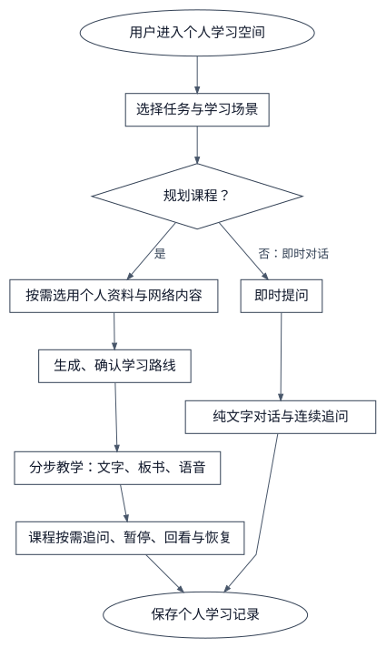
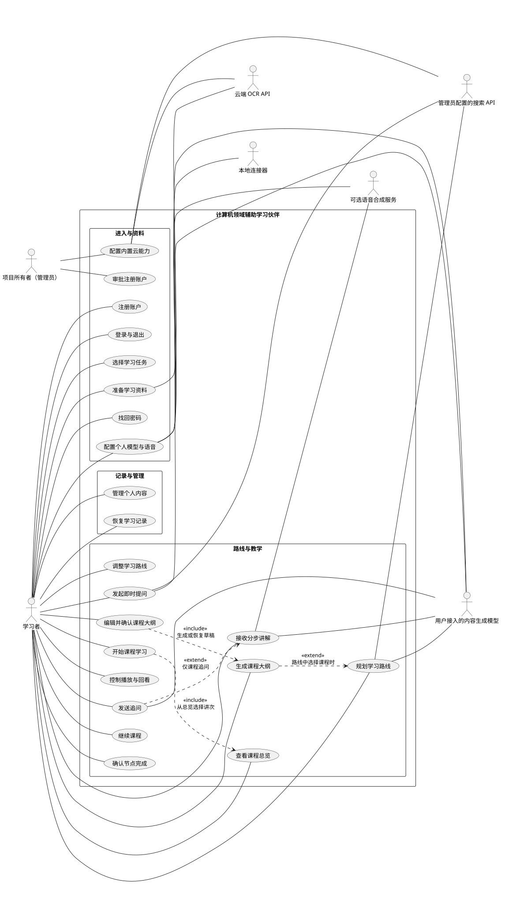
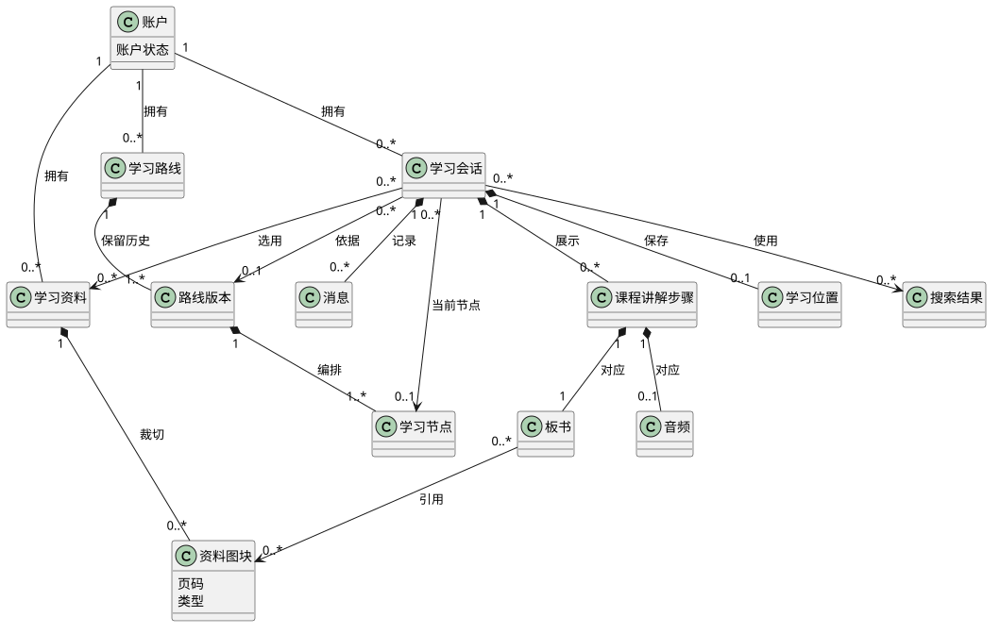
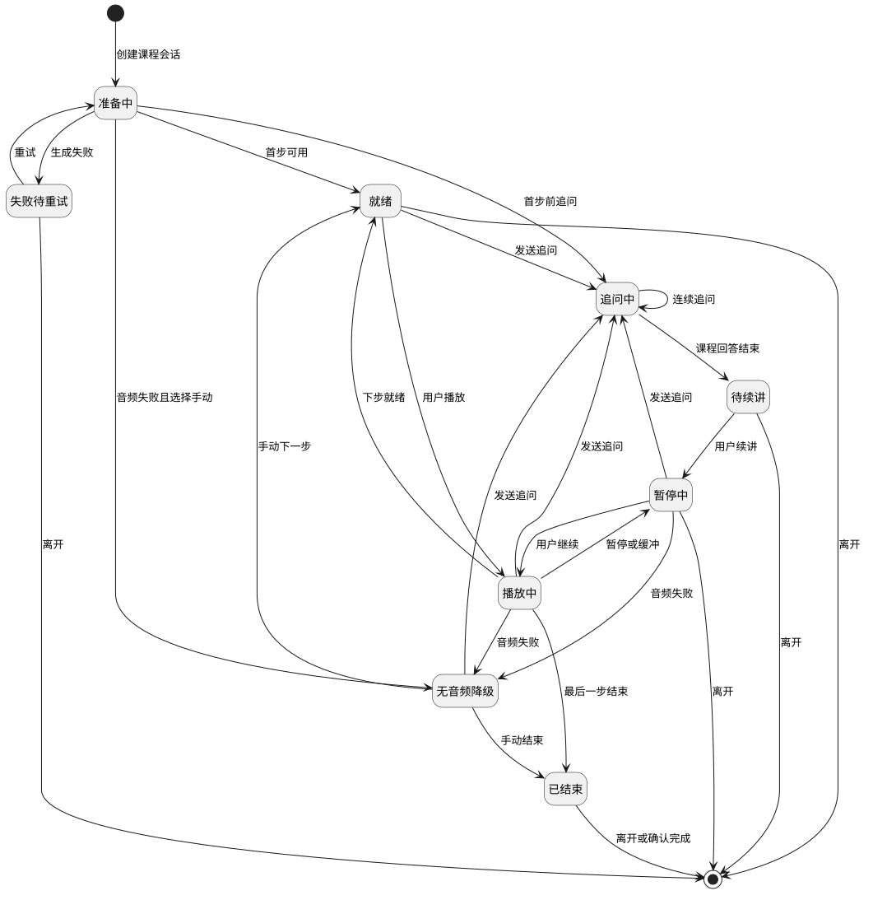
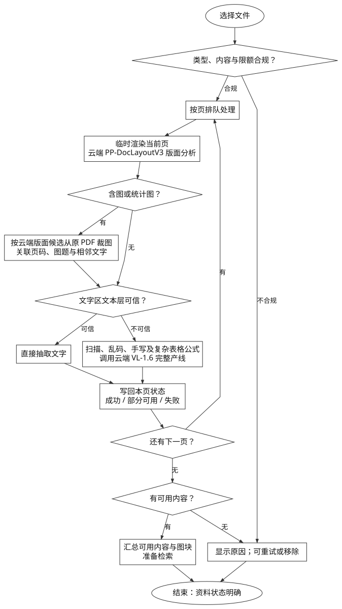
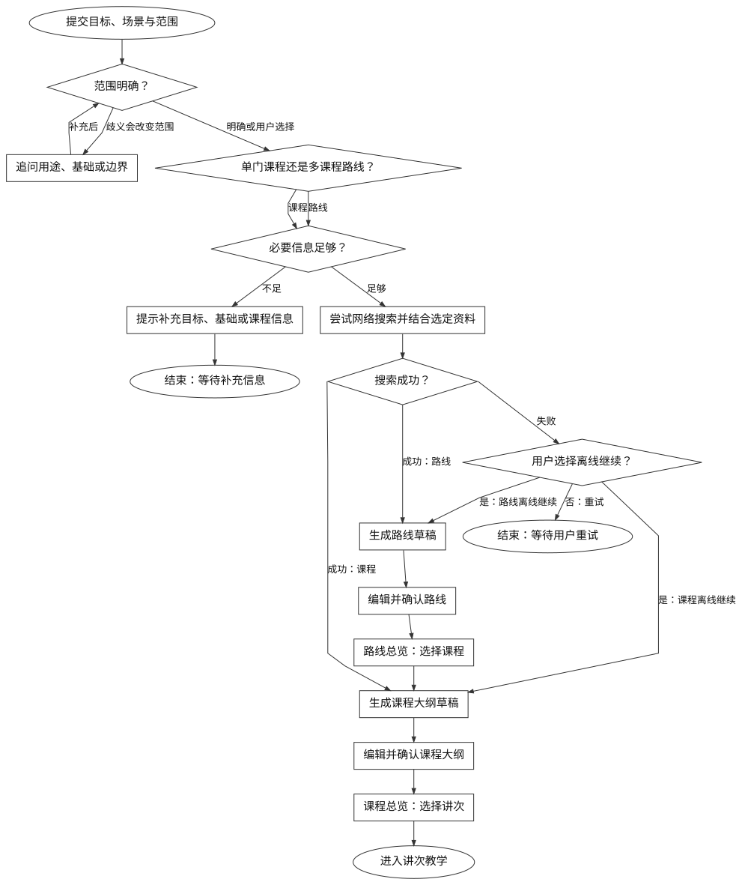
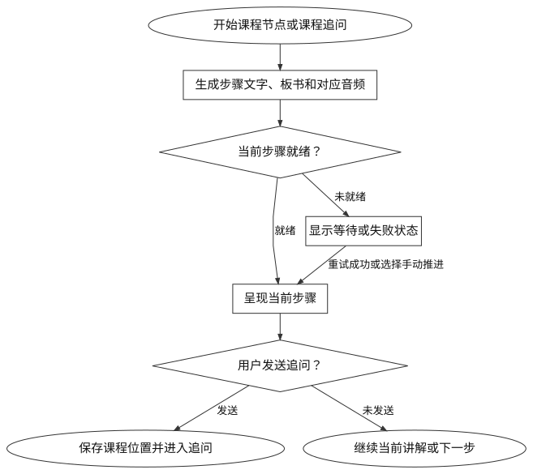
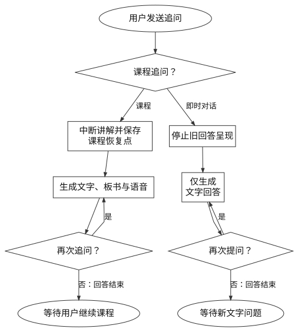

# PRD：计算机领域辅助学习伙伴

## 1. 总体说明

### 1.1 修订历史

| 日期         | 版本号  | 说明                                                    | 作者  |
| ---------- | ---- | ----------------------------------------------------- | --- |
| 2026-09-24 | 1.11 | 首版改用管理员配置的云端 PaddleOCR-VL-1.6；明确线路图与神经网络图的原图保留和视觉分析边界 | d   |
| 2026-09-24 | 1.12 | 推荐配置具备图像输入能力的模型但不强制；纯文字模型仍可使用并明确看图限制                  | d   |
| 2026-09-24 | 1.13 | 补充个人模型及管理员云能力配置用例，明确连接测试和能力缺失状态                       | d   |
| 2026-09-24 | 1.14 | 确定 Q-04 恢复、等待和超时指标；Q-08、Q-09 按用户决定后置评审                | d   |
| 2026-09-24 | 1.15 | 确定 Q-10 浏览器、屏宽和文本编码边界；Q-11 暂不设产品效果验收指标                | d   |

本文仍为需求草稿。项目资料已确认的核心要求与待评审的详细行为应区分；文中未决条件尚未形成发布承诺，所有流程均未表示已经完成实现或验收。

### 1.2 项目概述

计算机领域自学者和学校课程学习者需要把目标规划、教材理解、即时答疑和持续学习串起来。课程讲解中的结构、过程与代码关系可通过板书辅助表达；讲解被追问打断后，用户还需要找回原来的课程位置。本产品以浏览器中的个人学习空间承载两种路径：课程学习提供路线及相互对应的文字、板书和语音；即时提问直接用文字对话回答。

本 PRD 覆盖首版个人账户、四种学习入口、资料准备、路线规划与调整、课程教学、即时文字对话、追问与续讲、进度恢复和个人内容管理。首版以桌面 Web 为主，窄屏 Web 保持核心功能可访问。本项目目前没有其他已指定的 PRD；本期外能力列在 1.3，不在本文暗含实现承诺。

首版仅供项目所有者及参与开发人员使用。任何人可提交注册申请，但必须先验证邮箱，再由项目所有者审批；只有获批账户才能使用学习功能。每位使用者自行接入内容生成模型和可选 TTS 的 API，可填写接口地址和模型名称；支持 OpenAI 兼容格式、Anthropic 和 Gemini 原生格式，其他能力通过单独适配器接入。配置页推荐选择具备图像输入能力的模型，但不强制；纯文字模型仍可规划课程、对话和学习，涉及资料图像时须说明限制。产品内置资料检索；OCR 使用管理员统一配置的云端 PaddleOCR-VL-1.6 文档解析 API，联网搜索 API 也由管理员统一配置，普通使用者无需填写 OCR 或搜索 API。获批用户可填写本机、内网或公网 HTTPS 地址：服务器可达地址由服务器连接，用户电脑上的本地 API 则通过安装在该电脑上的本地连接器接入。产品可推荐服务，但不提供平台共用的付费模型 API 凭据，也不设统一的模型 API 消费预算。具体 Web 框架与板书库暂不选型，见 Q-07。

产品目标是让两类学习者都能从目标进入课程学习，或从具体问题进入即时文字对话，清楚识别资料与联网的能力边界，并在下次登录后找回记录。路线完成比例只表示用户确认完成的节点比例，不代表知识掌握程度；产品不预设覆盖整个计算机领域的完整课程库。

### 1.3 功能范围

图 1 首版学习业务逻辑图

| 范围      | 本 PRD 的业务结果                                                          | 对应原需求                   |
| ------- | -------------------------------------------------------------------- | ----------------------- |
| 账户与入口   | 用户验证邮箱、等待审批后进入独立空间，选择“规划课程 / 即时对话”及“自学 / 学校课程”；可找回密码并配置个人模型，管理员配置云能力 | FR-01—FR-05 及补充规则       |
| 资料与知识获取 | 选用 PDF、Markdown、TXT；处理扫描页；裁切并保留资料图块；区分资料内容、外部补充与联网失败                 | FR-06—FR-12             |
| 路线      | 收集规划信息，生成、调整和确认有先修关系的路线                                              | FR-13—FR-18             |
| 课程教学与追问 | 分步呈现文字、板书和音频；允许暂停、回看、追问和用户主动续讲                                       | FR-19—FR-30，限课程路径       |
| 即时文字对话  | 直接以文字回答和连续对话；不生成语音、视频或板书                                             | FR-04、FR-09—FR-12，及本次修订 |
| 记录与管理   | 保存位置，处理失败和过期结果，管理个人资料、课程及会话                                          | FR-31—FR-36             |

学习者负责选择任务、资料、路线版本及课程播放操作，并确认节点完成。系统负责隔离个人内容、管理生成与课程播放状态、保存学习记录；内置资料识别、资料检索与联网搜索可支持两种路径，用户接入的内容生成模型提供路线、讲解或即时文字回答，可选语音合成仅用于课程教学。各外部能力的供应商接口核对与具体部署方式见 Q-06、Q-07。学校系统不是首版依赖。

资料、提问或课程内容发送给外部服务处理前，界面须说明将发送的内容类别、接收服务及用途，并由用户确认；云端 OCR 与用户接入的内容生成模型分别提示。未接入或确认前，不向相应服务发送这些内容。内容生成模型未配置时不得发起生成任务，并提示配置；TTS 未配置时课程可手动推进；内置搜索不可用时由用户选择重试或明确离线继续；云端 OCR 不可用时扫描 PDF 不可用，文本 PDF、文本资料及其中已裁出的资料图块仍可使用。

全局规则：仅使用当前用户为本次任务选定且已可用的资料；未执行成功的搜索不能称为联网依据；资料不足时说明不足，外部解释不得冒充教材原文；同一次提交或重试不得产生重复有效结果；即时对话及其连续追问只产生文字消息，不进入课程板书、语音或播放流程；课程任意时刻最多播放一段音频，过期任务不得覆盖当前会话。个人资源的访问隔离与不可信内容边界见 1.6。

本期不做练习、小测、考试、掌握度测评与自动判题；不做在线代码执行、麦克风输入、实时语音通话、学校 LMS / 教师后台、付费订阅、课程集市、公开分享或多人白板。移动原生应用、专属模型训练、完整预置课程库也不在范围内。资料引用不强制显示；笔记与音频导出仅为后续候选，未纳入首版验收。

### 1.4 用户范围

| 角色或周边系统     | 职责                                                                                |
| ----------- | --------------------------------------------------------------------------------- |
| 自学者         | 提出计算机领域学习目标或即时问题，自主选择资料、调整路线和控制课程教学。                                              |
| 学校课程学习者     | 可凭课程名称、学习范围和当前进度的文字说明规划或提问；有大纲、教材、章节资料时可补充选用，无需连接学校系统。                            |
| 项目所有者（管理员）  | 审批、拒绝或停用注册账户，统一配置云端 OCR 与搜索 API；首个管理员账户在部署时由一次性初始化流程建立。                           |
| 资料解析与检索     | 本系统直接提取可信文本层、保留原 PDF、裁切资料图块并准备检索；扫描、乱码等区域调用管理员配置的云端 OCR，返回逐页状态和失败范围。              |
| 内置网络搜索      | 由管理员统一配置搜索 API，为路线规划和有时效性的问答提供实际检索结果及获取时间；普通使用者无需配置搜索 API。                        |
| 用户接入的内容生成模型 | 通过 OpenAI 兼容格式、Anthropic 或 Gemini 原生格式，依据学习任务、选定资料及可用网络信息生成路线、课程讲解与板书，或即时对话的文字回答。 |
| 可选语音合成服务    | 经独立适配器为课程讲解步骤及课程追问生成与文字版本对应的音频。                                                   |
| 本地连接器       | 安装于使用者电脑，使共享服务可在该用户授权下调用其电脑上运行的模型 API。                                            |

### 1.5 词汇表

| 术语        | 含义                                             |
| --------- | ---------------------------------------------- |
| 学习场景      | “自学”或“学校课程”；与任务类型组合成四种入口。                      |
| 路线版本      | 一次可查看、可应用的学习路线快照；后续调整不抹除历史进度。                  |
| 学习节点      | 路线中的一个学习单元，具有目标、范围、先修关系、预计投入和状态。               |
| 教学步骤      | 课程中的一段可独立呈现的讲解，文字、板书和对应音频共享同一内容版本；即时对话不生成教学步骤。 |
| 板书        | 用标题、要点、代码、公式、表格、节点、连线、高亮或资料原图等表达讲解内容的可回看画面。    |
| 资料图块      | 从资料页裁出的图，带页码、图题或图注（若有）及类型（统计图、结构图或其他）。         |
| 资料原图      | 板书中展示已有资料图块的元素；讲解结构时以该图为准。                     |
| 课程恢复点     | 课程被追问打断时保存的步骤、音频位置和板书状态；首步未开始时明确记录为尚未开始。       |
| TTS / OCR | 分别指文字转语音、图片文字识别。                               |

### 1.6 非功能需求

| 类别      | 要求及验证边界                                                                                                                                                                             |
| ------- | ----------------------------------------------------------------------------------------------------------------------------------------------------------------------------------- |
| 访问与隐私   | 服务端对资料（含资料图块）、课程、会话、消息、板书、音频、学习位置、检索结果和任务状态验证所有权；使用另一账户的资源标识或文件地址不能读取或变更。外部服务凭据不得进入浏览器、用户可见结果或日志，须按用户隔离并加密保存。账户密码不得明文存储或在响应中返回。                                                     |
| 不可信内容   | 上传资料和网页只能作为参考数据，不能改变权限、读取其他用户内容或触发任意代码执行；代码示例只展示和解释。                                                                                                                                |
| 可诊断性    | 失败记录能区分资料解析 / OCR、检索、搜索、生成、板书、TTS、保存等阶段，并关联处理过程；不默认记录完整私人资料正文或 API 密钥。使用者自接模型与可选 TTS；发送资料或内容前须提示并确认。内置 OCR、检索和联网搜索无需个人 API；上线前须核对所用外部服务的数据处理及保留条款，并向用户展示对应服务信息。                     |
| 恢复质量    | 课程切换步骤、暂停、发送追问和回答完成时保存位置；课程播放中按下表周期保存，以最近一次成功保存的位置恢复。即时对话保存文字消息和会话上下文。保存失败必须可见。正常网络下的最大回退、首段等待与服务超时按下表验收；任意用户自接 API 的供应商侧速度不作统一保证。                                                  |
| 兼容与可访问性 | 支持最新版及上一个大版本的 Chrome 和 Edge；桌面宽度不低于 1024 px，窄屏宽度不低于 360 px，均可访问核心操作。课程教学在窄屏以可切换区域呈现白板与对话，即时提问保持文字对话入口。基本操作支持键盘导航，文字可选择复制，操作入口有可读标签。TXT、Markdown 文件支持 UTF-8 和带 BOM 的 UTF-8；其他编码明确报错。 |
| 效果观察    | 首版可记录不含私人正文的功能事件，供试用时观察首节启动、用户主动继续学习、路线创建、课程追问后续讲及课程音频生成与播放情况。暂不设产品效果指标的数值目标或验收门槛；如后续需要指标口径、观察窗口、样本和目标，另行评审。此决定不改变本节已确认的性能与恢复验收要求。                                                  |

| 项目          | 已确认目标                | 起止点或触发条件                                                 |
| ----------- | -------------------- | -------------------------------------------------------- |
| 课程暂停响应      | 200 ms 内             | 从用户点击暂停，到当前音频停止且后续板书动作冻结。                                |
| 耗时任务状态反馈    | 1 秒内                 | 从用户发起上传、解析、搜索、内容生成或语音合成任务，到界面显示对应的处理中状态。                 |
| 课程位置周期保存    | 播放期间每 5 秒发起一次保存      | 切换步骤、暂停、发送追问和回答完成时另行保存；失败时不得显示为已成功保存。                    |
| 课程异常恢复回退    | 正常网络下不超过 10 秒        | 非正常刷新或重进课程后，对比中断前最后播放位置与恢复位置；断网或保存失败时明确提示未保存，不承诺 10 秒界限。 |
| 首段可读文字      | 受测参考 API 下 P95 ≤30 秒 | 从点击开始课程到首段非占位、可阅读的讲解文字出现。                                |
| 首段音频可播放     | 受测参考 TTS 下 P95 ≤60 秒 | 从点击开始课程到首段音频已缓冲并可由用户播放；未配置 TTS 的会话不纳入此指标。                |
| 搜索单次调用      | 默认 20 秒超时            | 超时后显示失败，用户可重试或明确选择离线继续。                                  |
| 内容生成单次调用    | 默认 90 秒超时            | 超时后保留已成功内容并显示失败，不无限等待。                                   |
| TTS 单次调用    | 默认 60 秒超时            | 超时后允许重试或无音频手动推进。                                         |
| 云端 OCR 单页处理 | 默认 180 秒超时           | 每页独立记录成功、部分可用或失败；长 PDF 逐页显示进度，不设整份 PDF 的单一等待上限。          |

P95 在同一受测参考配置、正常网络和两名并发使用者条件下，对固定样例各重复 30 次，以第 29 个最小值计算；验收记录模型和服务版本、浏览器、网络条件、样例及原始耗时。用户自填的未受测服务只按状态反馈、超时提示和可恢复性验收，不套用上述外部等待目标。

### 1.7 其他说明

以下列出尚待细化的条件与已明确后置的选型或评审。已确认首版仅供项目所有者及开发人员使用、开放注册但邮箱验证及获批后才能使用、个人总存储 5 GiB、每份扫描 PDF 最多 1000 页、外部处理前提示并确认、使用者自接模型与可选 TTS、管理员配置云端 OCR 和联网搜索 API、结构图以资料原图为讲解依据且识图模型为推荐而非强制、删除后在线存储 24 小时内与备份 30 天内清理。Q-10 的兼容边界已定；Q-11 按用户决定暂不设置产品效果验收指标。其他标注“建议”的方案不自动成为验收条件。

| 编号   | 待细化或后置事项                                                                                                             | 影响范围     |
| ---- | -------------------------------------------------------------------------------------------------------------------- | -------- |
| Q-06 | 产品层已确定云端 PaddleOCR-VL-1.6、管理员统一配置的搜索 API、三类模型协议、用户可选 TTS、本地连接器，以及失败降级、超时与外发确认规则。具体供应商接口、适配器协议细节和服务条款在实施前核对；不另设首版产品选项 | 实施前可行性核对 |
| Q-07 | 已确定采用 Web 服务并支持用户电脑本地连接器；自建或二次开发、Web 框架、白板渲染、具体部署与许可证在实施前的技术设计中再选，不作为本 PRD 的验收门槛                                     | 技术选型后置   |
| Q-08 | 跨方向内容准确性与资料一致性的样例、准则和人工评审负责人；用户本轮暂不确定，后续独立评审                                                                         | 教学质量验收后置 |
| Q-09 | 视觉参考图、默认模式、导航、配色与布局方案；用户本轮暂不确定，后续独立设计评审，原稿 65% / 35% 不作为验收条件                                                         | 界面规范后置   |

## 2. UC 部分

### 2.1 整体说明

图 2 首版用例图

图 3 学习领域对象图

图 4 课程教学状态图

### 2.2 UC 正文

#### UC\_注册账户：UC\_01

**用例概述**

| 栏    | 内容                                 |
| ---- | ---------------------------------- |
| 业务描述 | 让新学习者拥有可独立保存资料和进度的个人空间。            |
| 需求描述 | 使用邮箱和密码创建账户，并反馈无效信息或重复邮箱。          |
| 行为者  | 学习者                                |
| 前置条件 | 用户尚未登录。                            |
| 后置条件 | 提交成功后拥有待审批账户，获批后才能使用学习功能；失败时不创建账户。 |
| 原需求  | FR-01；邮箱密码、邮箱验证和获批后可用已确认。          |

**业务规则**

1. 注册输入邮箱、密码和确认密码；邮箱格式须有效，同一邮箱不能重复注册，密码和确认密码须一致。
2. 注册后先验证邮箱，再由项目所有者审批；账户在两步完成前不可使用学习功能。审批结果通知注册邮箱；拒绝或停用的账户不能进入学习空间。
3. 密码至少 15 个字符，接受至少 64 个字符，不强制大小写、数字和符号组合；拒绝常见或已泄露密码。密码不得明文保存或返回客户端。

**流程描述**

| 步骤  | 用户           | 系统                        | 规则                 |
| --- | ------------ | ------------------------- | ------------------ |
| 1   | 输入邮箱、密码和确认密码 | 校验邮箱格式、邮箱唯一性、密码规则及两次密码一致性 | 未通过校验则不创建账户。       |
| 2   | 提交并打开邮件验证链接  | 创建待验证账户；验证通过后进入待审批        | 验证前和待审批时均不可使用学习功能。 |
| 3   | 等待结果         | 项目所有者审核并通过、拒绝或停用账户；通知结果   | 只有已验证且获批账户可进入学习空间。 |

#### UC\_登录与退出：UC\_02

**用例概述**

| 栏    | 内容                              |
| ---- | ------------------------------- |
| 业务描述 | 学习者安全地返回自己的学习空间，并在离开时结束访问。      |
| 需求描述 | 使用邮箱和密码登录，处理失效会话与退出，保留已保存的学习记录。 |
| 行为者  | 学习者                             |
| 前置条件 | 已存在账户；退出需要有效登录会话。               |
| 后置条件 | 登录成功可访问本人内容；退出或失效后受保护资源不可继续读取。  |
| 原需求  | FR-01、FR-02。                    |

**业务规则**

1. 用户使用注册邮箱和密码登录；仅已验证且获批账户可进入学习空间。错误凭据使用统一失败反馈。对同一账户 15 分钟内连续失败 5 次时暂停登录 15 分钟，到期自动恢复；限制和反馈不能泄露账户是否存在。
2. 未登录访问受保护内容时进入登录流程；登录失效不删除此前已保存的位置。密码找回见 UC\_找回密码。

**流程描述**

| 步骤  | 用户         | 系统        | 规则              |
| --- | ---------- | --------- | --------------- |
| 1   | 输入并提交邮箱和密码 | 校验身份并建立会话 | 错误凭据不开放个人内容。    |
| 2   | 访问个人空间     | 仅返回当前账户资源 | 所有权校验在服务端执行。    |
| 3   | 选择退出       | 使当前会话失效   | 原会话不能继续读取受保护资源。 |

#### UC\_选择学习任务：UC\_03

**用例概述**

| 栏    | 内容                                      |
| ---- | --------------------------------------- |
| 业务描述 | 让学习者从目标或问题直接进入合适的学习路径。                  |
| 需求描述 | 组合选择规划课程 / 即时对话与自学 / 学校课程，保留已输入内容并提交任务。 |
| 行为者  | 学习者                                     |
| 前置条件 | 已登录；可无附件。                               |
| 后置条件 | 规划任务进入信息收集；即时提问创建独立文字对话会话。              |
| 原需求  | FR-03—FR-05。                            |

**界面描述**

首页多行输入位于中央，任务类型选择位于输入区上方，学习场景选择位于输入区内；具体视觉样式待 Q-09。

| 元素    | 类型   | 规则                   |
| ----- | ---- | -------------------- |
| 任务类型  | 选择   | 规划课程、即时对话，二选一。       |
| 学习场景  | 选择   | 自学、学校课程，二选一；与任务类型独立。 |
| 目标或问题 | 多行文本 | 切换模式时保留已输入内容。        |
| 附件    | 列表   | 显示已选附件及处理状态。         |
| 提交    | 操作   | 纯空输入且无可用附件时不可提交。     |

**业务规则**

1. 四种组合均可进入对应流程；即时对话不要求先建路线，只以文字消息交互。
2. 模式切换保留文字和附件，引导内容与当前组合一致；初始默认模式待 Q-09 决定。
3. 仅有未就绪附件时，不将其作为可用资料提交。

**流程描述**

| 步骤  | 用户              | 系统            | 规则                           |
| --- | --------------- | ------------- | ---------------------------- |
| 1   | 选择任务与场景，输入目标或问题 | 保留当前输入和附件     | 两组选项互不覆盖。                    |
| 2   | 按需准备资料后提交       | 检查文字或可用附件     | 纯空请求被阻止；未就绪资料按 UC\_准备学习资料处理。 |
| 3   | —               | 进入规划或即时文字对话会话 | 场景和本次选定资料随任务传入。              |

#### UC\_准备学习资料：UC\_04

**用例概述**

| 栏    | 内容                                                        |
| ---- | --------------------------------------------------------- |
| 业务描述 | 用户用自己的教材、课堂材料或笔记辅助规划与答疑。                                  |
| 需求描述 | 上传、解析、选用和移除资料，裁切并保留资料图块，明确可用、部分可用及失败状态。                   |
| 行为者  | 学习者；资料解析与检索；云端 OCR                                        |
| 前置条件 | 已登录；正在准备规划或即时提问，或管理个人资料。                                  |
| 后置条件 | 仅被选定且已可用的资料可进入本次任务；失败或移除的资料不参与。                           |
| 原需求  | FR-06—FR-10、FR-33、FR-34；单文件、单次、个人总存储、扫描 PDF 页数及文本编码边界已确认。 |

**业务规则**

1. 接受 `.pdf`、`.md`、`.markdown`、`.txt`。单个文件不超过 20 MiB，一次上传不超过 10 个文件；个人总存储上限 5 GiB，每份扫描 PDF 最多 1000 页。资料图块计入个人存储。TXT 与 Markdown 支持 UTF-8 和带 BOM 的 UTF-8；其他编码明确报错，不能标为可用。超出任一限制或扩展名与实际内容不匹配时明确拒绝并说明删除资料或拆分文件等处理方式。空文件不能标为可用。
2. PDF 逐页进入有界后台队列，不把最多 1000 页同时渲染到内存。原 PDF 保存在用户空间；每页可按约 200 DPI 临时渲染，小字、超大页或识别不清时按区域调整分辨率，限制单页像素及任务资源。需要视觉解析的页面或区域调用管理员配置的云端 PaddleOCR-VL-1.6 文档解析 API，启用完整产线的 PP-DocLayoutV3 版面分析、区域裁剪、阅读顺序和 VL 识别；只调用 VL 子模型不视为完整产线。逐页记录调用模型、处理时间和结果，不把云端结果替代原 PDF。
3. 逐区域判断 PDF 文本层是否可信，综合有效字符、乱码、阅读顺序及区域对应关系；可信文字区直接抽取，不重复 OCR。扫描、乱码和手写文字区进入 VL 识别；手写识别质量不足时标明部分可用或失败，不保证全部识别。表格和公式在原生提取无法保留结构时也进入 VL；成功时保存 Markdown 表格或公式表达，公式可用 LaTeX 表示；失败时保留原区域并标明不足。
4. 云端 OCR 返回的图片和版面区域只作为图块候选；系统依据其区域信息从原 PDF 临时渲染页裁出清晰原图，保留 PDF 页码、区域坐标，并关联可识别的图题和相邻文字。若图块定位或裁切失败，保留原 PDF 页码并允许按需重绘整页查看，不把缺图标为成功；没有图题时不编造。统计图可另抽数据表，原图仍保留，抽表不替代原图。结构图（线路图、电路图、网络结构图、神经网络结构图、流程图等）以原图为主内容，OCR 读出的标签文字只供检索；抽出文字或简化示意图都不算已还原连线、箭头、层级或结构。应检出而裁切失败，或关键结构图未进入图块时，该范围最多标为部分可用，并写明关键结构图未进入讲解素材。代码、表格、图表识别不足时明确说明。
5. 每页写回成功、部分可用或失败状态，保存失败区域和原因；仅重试失败页或区域，不重复纳入已成功的内容。混合 PDF 可使用成功区域和页面，但不得声称已完整阅读。资料图块进入检索时须带原图、图题、相邻文字与页码。配置具备图像输入能力的模型是推荐项，不是上传、规划或开始学习的前置条件；讲解线路或神经网络结构时，仅在已配置模型支持图像输入且用户已确认外发图块的情况下，将原图交给模型分析。对连线、箭头或层级看不清时说明不确定并展示原图，不生成未经核实的精确连接关系、网表或网络架构。模型不支持图像输入时，只凭可靠文字回答并说明未解读图像。
6. 使用资料时提供整体章节结构、相关局部内容和已有资料图块；结构或关键结构图不可用时不得声称按完整教材规划。只有当前用户、本次选定且已可用的资料可作为资料依据。不把结构图还原为可仿真网表或可运行代码作为资料可用条件。

**流程描述**

触发事件：用户选择文件或对失败资料重试。

图 5 学习资料准备流程图

| 步骤  | 用户        | 系统                                       | 规则                           |
| --- | --------- | ---------------------------------------- | ---------------------------- |
| 1   | 选择文件      | 校验类型、实际内容和限额                             | 单文件 ≤20 MiB、单次 ≤10 个；超限说明原因。 |
| 2   | 等待或查看处理状态 | 显示上传、逐页解析进度、裁切图块、准备检索及逐页成功 / 部分可用 / 失败状态 | 未就绪时不声称已阅读；图块缺失按部分可用或失败标明。   |
| 3   | 选用、重试或移除  | 将可用内容关联本次任务                              | 同一失败处理重试不得重复纳入资料。            |

异常：加密、损坏、提取失败、内置 OCR 不可用或未提取出内容时，提示原因及适用的重试或改传文字版本；OCR 不可用时扫描 PDF 不可标为可用，文本 PDF、文本资料及其中已裁出的资料图块仍可使用；部分可用只使用成功内容。

#### UC\_规划学习路线：UC\_05

**用例概述**

| 栏    | 内容                                         |
| ---- | ------------------------------------------ |
| 业务描述 | 把宽泛目标或学校课程内容整理为可逐节点学习的路线。                  |
| 需求描述 | 收集必要信息，结合选定资料和真实网络搜索，生成可查看的路线预览。           |
| 行为者  | 学习者；内置网络搜索；用户接入的内容生成模型                     |
| 前置条件 | 已选择“规划课程”及学习场景；目标或可用资料足以发起任务。              |
| 后置条件 | 得到路线预览，或明确停留在补充、重试或失败状态。                   |
| 原需求  | FR-09、FR-11—FR-15；学校课程无附件路径已确认，内容质量待 Q-08。 |

**业务规则**

1. 自学提取目标、基础和可用时间。学校课程在无附件或资料不足时，文字至少要能确定课程名称或明确主题、学习范围（全课、章节或具体主题）和当前进度（“尚未开始”也有效）；缺哪项只追问哪项。大纲、教材和附件可选，不以未上传资料阻止规划；跳过其他非必要信息时明示采用的假设。
2. 计算机领域目标不按单一学科白名单阻断。路线包含整体目标、阶段和可持续识别的节点；节点有标题、目标、内容范围、先修关系、预计投入和状态。先修关系不得成环。
3. 学校课程优先匹配用户提供的大纲、教材与进度；无附件或资料不足时可搜索公开课程资料补充。搜索结果须标为外部参考，不能冒充该校的实际教学大纲；额外基础标为“补充基础”。资料不足要说明，网络或模型补充不能伪造教材原文。关键结构图未进入讲解素材时不得声称已按完整教材结构规划。
4. 路线规划实际尝试内置网络搜索并记录获取时间；失败时由用户选择重试或在具备上述最少文字信息的前提下明确选择离线继续，不静默降级。软件版本或更新相关问答按需搜索，优先官方文档和可靠教学内容。内容生成模型未配置时提示用户先配置，不发起生成。

**流程描述**

触发事件：用户提交规划请求。

图 6 学习路线规划流程图

| 步骤  | 用户           | 系统          | 规则                             |
| --- | ------------ | ----------- | ------------------------------ |
| 1   | 提交目标、场景和选定资料 | 提取已知信息并判断缺口 | 学校课程无附件时至少明确课程或主题、学习范围及当前进度。   |
| 2   | 按需补充信息       | 尝试联网并使用可用资料 | 搜索可补公开资料；失败时等待用户重试或明确选择基于文字继续。 |
| 3   | 查看路线预览       | 展示阶段、节点和依赖  | 预计投入只是估算，不代表掌握保证。              |

#### UC\_调整学习路线：UC\_06

**用例概述**

| 栏    | 内容                                  |
| ---- | ----------------------------------- |
| 业务描述 | 用户在开始或继续学习前修正路线，使其符合实际进度。           |
| 需求描述 | 修改标题、增删节点、调整顺序，或请求 AI 生成新版本并决定是否应用。 |
| 行为者  | 学习者；用户接入的内容生成模型                     |
| 前置条件 | 有可查看的路线或路线预览。                       |
| 后置条件 | 用户确认后形成当前路线版本；未应用的预览不改变原路线和进度。      |
| 原需求  | FR-16、FR-17。                        |

**业务规则**

1. 任何改动不得形成循环依赖或违反先修顺序；发现冲突时要求修正。
2. AI 调整先展示新版本，明确应用后才替换当前版本。
3. 历史学习记录关联原路线版本；从新路线删除节点仍可回看该节点既有记录，删除整门课程是 UC\_管理个人内容 的独立操作。

**流程描述**

| 步骤  | 用户            | 系统          | 规则               |
| --- | ------------- | ----------- | ---------------- |
| 1   | 编辑路线或提出文字调整要求 | 生成可查看的候选版本  | 原版本保持可追溯。        |
| 2   | 查看依赖与变更       | 校验先修关系      | 冲突时不应用，并说明需修正之处。 |
| 3   | 确认应用或放弃       | 应用新版本或保留原版本 | 未确认的预览不改变当前进度。   |

#### UC\_开始课程学习：UC\_07

**用例概述**

| 栏    | 内容                             |
| ---- | ------------------------------ |
| 业务描述 | 用户从确认的路线进入某个节点的教学。             |
| 需求描述 | 创建或继续节点会话，进入教学工作区并保留节点与路线版本关系。 |
| 行为者  | 学习者                            |
| 前置条件 | 已有确认的路线及可学习节点。                 |
| 后置条件 | 当前节点进入学习中；会话可接收分步讲解。           |
| 原需求  | FR-16—FR-19、FR-31。             |

**业务规则**

1. 节点状态只使用未开始、学习中、用户确认完成；开始播放或播放结束均不自动表示掌握。
2. 继续已有节点时保留原路线版本、记录和已保存位置。

**流程描述**

| 步骤  | 用户            | 系统             | 规则             |
| --- | ------------- | -------------- | -------------- |
| 1   | 在路线中选节点并开始或继续 | 建立或读取节点会话      | 先修关系与当前路线保持一致。 |
| 2   | 进入教学          | 展示当前步骤、板书和文字记录 | 播放由用户开始操作触发。   |

#### UC\_发起即时提问：UC\_08

**用例概述**

| 栏    | 内容                                |
| ---- | --------------------------------- |
| 业务描述 | 用户遇到单个概念或技术问题时，直接通过文字对话获得解释。      |
| 需求描述 | 不建路线也可创建独立文字问答会话，结合所选资料和按需联网回答。   |
| 行为者  | 学习者；内置网络搜索；用户接入的内容生成模型            |
| 前置条件 | 已选择“即时对话”并提交有效问题或可用附件。            |
| 后置条件 | 独立会话保存文字问题、回答及处理状态；回答结束后等待新输入。    |
| 原需求  | FR-04、FR-09—FR-12；本次修订限定即时对话为纯文字。 |

**界面描述**

即时对话显示文字消息记录与持续可用的文字输入；生成中、失败及联网降级状态在对话中可辨认。不显示课程白板或音频播放控件。

**业务规则**

1. 即时会话沿用自学 / 学校课程场景和本次选定资料；不需要先建路线。
2. 资料不足与外部补充须明确区分。涉及软件版本或更新时按需使用内置搜索，搜索失败的降级需要用户选择；模型未配置时提示用户先配置，不生成回答。
3. 回答及连续追问仅生成文字消息，不生成语音、视频或板书，也不创建课程教学步骤。资料来源或脚注不强制展示。涉及资料中的结构图时，如当前模型支持图像输入且用户确认外发图块，可分析原图后仅以文字回答并指出页码；模型不支持图像或图中关系不清时说明限制与不确定性，不编造线路或层级关系。即时对话不插入课程板书或播放音频。
4. 用户可在回答生成中或回答后继续用文字追问；旧回答的过期结果不得覆盖当前对话。

**流程描述**

| 步骤  | 用户           | 系统            | 规则                   |
| --- | ------------ | ------------- | -------------------- |
| 1   | 提交问题和选定资料    | 创建独立会话并读取可用资料 | 未选资料不混入依据。           |
| 2   | 按需选择联网失败后的处理 | 生成文字回答并显示在对话中 | 用户可重试或明确选择仅基于现有信息继续。 |
| 3   | 阅读回答或继续提问    | 保存文字消息和会话状态   | 不进入板书、TTS、视频或播放流程。   |

#### UC\_接收分步讲解：UC\_09

**用例概述**

| 栏    | 内容                                   |
| ---- | ------------------------------------ |
| 业务描述 | 用户通过文字、板书和语音理解同一知识点。                 |
| 需求描述 | 按步骤准备并呈现一致的完整文字、适当板书及对应音频。           |
| 行为者  | 学习者；用户接入的内容生成模型；可选语音合成服务             |
| 前置条件 | 已进入课程节点，或正在回答课程中的追问。                 |
| 后置条件 | 讲解步骤及其版本被记录；可继续、追问、回看或处理失败。          |
| 原需求  | FR-19—FR-22、FR-24、FR-25、FR-33、FR-34。 |

**界面描述**

课程教学工作区在桌面左侧显示白板，右侧按顺序显示讲解、追问与回答，底部文字输入持续可访问。右侧完整文字支持中文、代码块和公式，并显示生成中或失败状态；窄屏呈现规则见 1.6。即时对话不使用此工作区的白板与播放能力。

**业务规则**

1. 每次课程讲解及课程追问回答都有完整文字与至少一个有助理解的板书元素；配置并成功调用 TTS 时还有对应音频。未配置或调用失败时可由用户选择无音频手动推进，不得称为完整语音交付。状态及错误消息不需要板书和语音；简单课程问题可只有一步。即时对话回答不适用本用例。
2. 文字、板书、音频指向同一步骤版本；代码或公式朗读可口语化，但含义不得改变。文字更新后旧音频不能继续作为其对应音频。
3. 以步骤级同步呈现；已生成未播放的内容不得标成已播放。不必等待整课音频完成，已就绪步骤可先播放。
4. 板书按内容选用标题、要点、代码、公式、表格、节点、连线、高亮、资料原图等形式，典型结构和时序可表达，不用无关图形凑数。
5. 讲解依赖某张结构图且对应资料图块可用时，该步骤板书必须包含该资料原图，并可另用节点或连线作简化示意。生成模型重绘的示意图不能替代资料原图。把资料图块发送给用户接入的生成模型前，仍须按全局规则提示并确认。
6. 应使用的资料图块缺失时说明不足，只用已成功内容，不得称为已按原图完整讲解。

**流程描述**

触发事件：课程步骤开始，或课程中的追问需要讲解。

图 7 分步教学流程图

| 步骤  | 用户                | 系统            | 规则                  |
| --- | ----------------- | ------------- | ------------------- |
| 1   | 等待当前步骤            | 准备文字、板书及同版本音频 | 生成中与失败状态可见。         |
| 2   | 点击播放，或在无音频降级时手动推进 | 呈现当前步骤并推进板书   | 音频缓冲或未就绪时不自动推进后续板书。 |
| 3   | 选择继续或发送追问         | 保存步骤进度并进入相应路径 | 追问按 UC\_发送追问。       |

异常：模型、板书或 TTS 失败时仅重试失败环节，保留已成功内容。TTS 失败可由用户选择无音频手动推进，但不得称为完整语音交付。

#### UC\_控制播放与回看：UC\_10

**用例概述**

| 栏    | 内容                          |
| ---- | --------------------------- |
| 业务描述 | 用户按自己的节奏听、看和复习讲解。           |
| 需求描述 | 播放、暂停、重播、静音、手动推进、浏览板书与文字记录。 |
| 行为者  | 学习者                         |
| 前置条件 | 课程中至少一个讲解步骤已生成，或有可回看的课程历史。  |
| 后置条件 | 播放位置和浏览状态与用户操作一致，后续可恢复。     |
| 原需求  | FR-23—FR-25、FR-30、FR-31。    |

**业务规则**

1. 暂停停止当前音频位置和后续板书动作，保留已显示内容；恢复或重播不重复叠加板书。
2. 静音仅关闭声音，仍按对应音频时长推进，不等于暂停。无音频降级由用户手动“下一步”，不虚构播放时长。
3. 用户缩放、拖动或回看白板时不自动抢回视角；可主动回到当前讲解。上翻文字记录时不强制滚动，可主动回到最新内容。

**流程描述**

| 步骤  | 用户              | 系统          | 规则            |
| --- | --------------- | ----------- | ------------- |
| 1   | 播放、暂停、重播或静音     | 调整当前步骤呈现    | 任意时刻最多一段音频播放。 |
| 2   | 缩放、拖动或查看旧记录     | 保持用户选择的浏览位置 | 新生成内容不打断回看。   |
| 3   | 选择回到当前讲解 / 最新内容 | 定位当前步骤或记录末尾 | 回看本身不等于继续播放。  |

#### UC\_发送追问：UC\_11

**用例概述**

| 栏    | 内容                                           |
| ---- | -------------------------------------------- |
| 业务描述 | 用户在课程讲解或即时对话中继续澄清疑点；课程追问还需保留原课程进度。           |
| 需求描述 | 发送时中断当前内容，结合对应会话语境回答，并支持连续追问；即时对话只返回文字。      |
| 行为者  | 学习者；用户接入的内容生成模型                              |
| 前置条件 | 课程处于生成、等待或播放阶段，或即时文字会话处于回答生成、等待输入阶段。         |
| 后置条件 | 问答记录被保存；课程追问还保存独立板书并进入待续讲，即时会话仅保留文字记录并等待新输入。 |
| 原需求  | FR-26—FR-28、FR-34。                           |

**业务规则**

1. 仅聚焦输入框或输入文字不触发中断；发送问题才中断。生成中和播放中都能发送。
2. 课程追问保存步骤、已保存音频位置及板书状态；首步未开始明确记录“尚未开始”。课程回答使用当前步骤、相关板书、选定资料和会话理解指代，并按 UC\_接收分步讲解 呈现。
3. 课程追问板书与原课程板书分开；连续追问始终保留最初课程恢复点。被新追问打断的旧课程回答不自动恢复播放，但可从历史重播。
4. 即时对话追问只使用文字会话和选定资料的上下文，回答只生成文字；被新问题打断的旧回答不自动覆盖当前消息，可在历史中查看已保存的文字。

**流程描述**

触发事件：用户发送追问。

图 8 课程与即时对话追问流程图

| 步骤  | 用户                 | 系统                       | 规则              |
| --- | ------------------ | ------------------------ | --------------- |
| 1   | 发送问题               | 中断当前内容；课程另存原恢复点          | 输入但未发送不执行此步。    |
| 2   | 阅读回答，课程中也可收听；或再次追问 | 课程生成文字、独立板书和音频；即时对话只生成文字 | 连续课程追问不覆盖最初恢复点。 |
| 3   | 回答结束               | 课程等待用户续讲；即时会话等待新文字输入     | 旧结果完成后不抢占当前会话。  |

#### UC\_继续课程：UC\_12

**用例概述**

| 栏    | 内容                          |
| ---- | --------------------------- |
| 业务描述 | 追问结束后，用户自主回到原课程。            |
| 需求描述 | 定位原课程步骤、音频位置与板书视角，再由用户继续播放。 |
| 行为者  | 学习者                         |
| 前置条件 | 课程追问回答结束，存在课程恢复点。           |
| 后置条件 | 原课程状态恢复；追问回答停止占用当前播放。       |
| 原需求  | FR-27—FR-29。                |

**业务规则**

1. 课程追问结束不自动续讲；即时对话没有此操作。
2. 首步尚未开始时从首步开始。无法精确定位音频时可从该步骤开头重播，但须提示用户，不重复追加板书或跳到下一步骤。

**流程描述**

| 步骤  | 用户       | 系统               | 规则          |
| --- | -------- | ---------------- | ----------- |
| 1   | 选择“继续课程” | 读取最初课程恢复点并切回课程板书 | 连续追问不得改写该点。 |
| 2   | 点击播放     | 从保存位置或已提示的步骤开头继续 | 不与追问音频同时播放。 |

#### UC\_确认节点完成：UC\_13

**用例概述**

| 栏    | 内容                           |
| ---- | ---------------------------- |
| 业务描述 | 用户明确记录自己的学习进展。               |
| 需求描述 | 由用户确认节点完成并更新路线完成比例。          |
| 行为者  | 学习者                          |
| 前置条件 | 已有路线节点及当前用户的学习记录。            |
| 后置条件 | 节点成为“用户确认完成”，路线完成比例按确认节点数更新。 |
| 原需求  | FR-18。                       |

**业务规则**

播放结束不自动确认完成，不显示掌握率，不自动出题、评分或以答题解锁节点。用户未确认前节点可保持学习中。

**流程描述**

| 步骤  | 用户     | 系统          | 规则              |
| --- | ------ | ----------- | --------------- |
| 1   | 确认节点完成 | 记录确认并更新路线比例 | 统计按用户确认完成的节点计算。 |

#### UC\_恢复学习记录：UC\_14

**用例概述**

| 栏    | 内容                                   |
| ---- | ------------------------------------ |
| 业务描述 | 用户在刷新、重新登录或网络恢复后继续原有学习。              |
| 需求描述 | 找回课程、路线版本、会话与消息；课程还找回板书和最近成功保存的播放位置。 |
| 行为者  | 学习者                                  |
| 前置条件 | 当前用户已有保存的课程或会话。                      |
| 后置条件 | 进入正确记录；课程恢复位置后保持暂停，即时对话显示历史文字并等待新输入。 |
| 原需求  | FR-05、FR-17、FR-31—FR-34。             |

**业务规则**

1. 首页仅显示本人最近课程和会话；保存失败不能显示为成功。课程异常中断以最近一次成功保存的位置为准；即时对话恢复已保存的文字消息与会话上下文。
2. 断网时已加载的文字可读，课程中已加载的板书也可看；依赖远程资源的后续处理暂停。重连后课程不自动发声，即时对话也不重复提交已有问题。
3. 任务即使不能取消，过期结果仍不得覆盖新会话或新追问；用户明确发起的新问题不能被重复操作保护误丢弃。

**流程描述**

| 步骤  | 用户              | 系统                      | 规则               |
| --- | --------------- | ----------------------- | ---------------- |
| 1   | 从近期学习或历史会话打开记录  | 读取对应路线版本、消息和位置          | 只返回当前账户内容。       |
| 2   | 查看恢复结果          | 呈现已保存文字；课程另恢复板书并保持暂停    | 课程首次音频播放需用户操作触发。 |
| 3   | 课程中选择继续，或重试失败环节 | 课程从最近成功位置继续；即时对话只重试失败消息 | 保留此前已成功的产物和文字记录。 |

#### UC\_管理个人内容：UC\_15

**用例概述**

| 栏    | 内容                          |
| ---- | --------------------------- |
| 业务描述 | 用户整理自己的课程、会话和学习资料。          |
| 需求描述 | 查看、重命名或删除课程和会话，并删除已上传资料。    |
| 行为者  | 学习者                         |
| 前置条件 | 已登录且拥有要管理的内容。               |
| 后置条件 | 已确认的变更对本人内容生效；删除资源不再供新任务访问。 |
| 原需求  | FR-35；删除后的在线与备份清理周期已确认。     |

**业务规则**

1. 删除前须确认，确认框说明在线存储与备份清理期限；不得管理其他用户内容。
2. 删除资料后立即排除后续检索，既有讲解记录保留并提示关联资料已删除。
3. 删除课程或会话时停止相关任务、清理专属音频和板书；不得连带删除其他课程仍使用的资料。删除确认后立即撤销产品访问；原文件、资料图块、索引、专属音频和板书在 24 小时内从在线存储清除，备份在 30 天内轮换清除。备份恢复不得使已删除内容重新对用户可见；外部服务自身的保留周期需按其条款另行告知。

**流程描述**

| 步骤  | 用户        | 系统             | 规则                |
| --- | --------- | -------------- | ----------------- |
| 1   | 查看并选择本人内容 | 显示可管理的课程、会话或资料 | 不显示他人资源。          |
| 2   | 重命名或请求删除  | 应用名称变更，或要求删除确认 | 未确认删除不改变内容。       |
| 3   | 确认删除      | 撤销访问并执行关联清理    | 共享资料和历史讲解按业务规则保留。 |

#### UC\_审批注册账户：UC\_16

**用例概述**

| 栏    | 内容                         |
| ---- | -------------------------- |
| 业务描述 | 项目所有者控制首版的实际使用范围。          |
| 需求描述 | 审核已验证邮箱的注册申请，通过、拒绝或停用账户。   |
| 行为者  | 项目所有者（管理员）                 |
| 前置条件 | 管理员已登录；申请人的邮箱已验证。          |
| 后置条件 | 账户状态与审核结果一致；只有获批账户可使用学习功能。 |
| 原需求  | 首版仅供项目所有者及开发人员使用的补充规则。     |

**业务规则**

1. 首个管理员账户在部署时通过一次性初始化流程建立；普通注册账户不能自行获得管理员权限或自我审批。
2. 管理员可查看待审批邮箱与申请时间，逐一通过或拒绝，并可停用已批准账户。审批结果通知申请邮箱；停用后现有会话立即失效，但不自动删除其资料。
3. 账户状态至少区分待验证、待审批、已批准、已拒绝、已停用。审核操作记录操作者、对象、动作及时间，不记录密码或 API 密钥。

**流程描述**

| 步骤  | 管理员        | 系统          | 规则             |
| --- | ---------- | ----------- | -------------- |
| 1   | 打开待审批列表    | 仅显示已验证邮箱的申请 | 未验证邮箱不可进入审批。   |
| 2   | 选择通过或拒绝    | 更新账户状态并通知邮箱 | 通过后用户才可使用学习功能。 |
| 3   | 必要时停用已批准账户 | 立即撤销其登录会话   | 不连带删除用户内容。     |

#### UC\_找回密码：UC\_17

**用例概述**

| 栏    | 内容                           |
| ---- | ---------------------------- |
| 业务描述 | 用户忘记密码时恢复对原账户的访问。            |
| 需求描述 | 用注册邮箱接收一次性链接并设置新密码。          |
| 行为者  | 学习者                          |
| 前置条件 | 用户可访问注册邮箱。                   |
| 后置条件 | 有效重置后旧密码和旧会话失效；未完成重置时账户凭据不变。 |
| 原需求  | FR-01；邮箱密码方案的补充规则。           |

**业务规则**

1. 申请重置时无论邮箱是否存在，页面都给出一致反馈；重置申请受频率限制，不泄露账户存在性。
2. 链接使用一次性随机令牌，30 分钟后或成功使用后失效；只允许设置新密码，不授予审批或管理员权限。
3. 新密码遵循注册密码规则，重置成功使此前登录会话失效，并向注册邮箱发送通知。

**流程描述**

| 步骤  | 用户           | 系统             | 规则                 |
| --- | ------------ | -------------- | ------------------ |
| 1   | 提交注册邮箱       | 统一反馈并按条件发送重置邮件 | 不提示邮箱是否存在。         |
| 2   | 打开邮件链接，填写新密码 | 验证令牌、期限和密码规则   | 无效或过期则不修改密码。       |
| 3   | 提交           | 更新密码并撤销旧会话     | 链接不可再次使用；账户审批状态不变。 |

#### UC\_配置个人模型与语音：UC\_18

**用例概述**

| 栏    | 内容                                    |
| ---- | ------------------------------------- |
| 业务描述 | 用户使用自己的内容生成模型，并按需启用课程语音。              |
| 需求描述 | 保存、测试、选择或移除个人模型与可选 TTS 配置，识别是否支持图像输入。 |
| 行为者  | 学习者；用户接入的内容生成模型；可选语音合成服务；本地连接器        |
| 前置条件 | 账户已获批并登录。                             |
| 后置条件 | 配置仅供本人任务使用；测试失败或未配置的能力明确标为不可用。        |
| 原需求  | 用户自接 API、推荐识图模型但不强制的补充规则。             |

**业务规则**

1. 内容生成模型可选择 OpenAI 兼容、Anthropic 原生或 Gemini 原生格式，填写接口地址、模型名与所需凭据。配置页说明图像输入能力为推荐项；纯文字模型也可保存和用于文字任务。TTS 单独配置，未配置时课程可选择无音频手动推进。
2. 公网 HTTPS 与服务器可达的内网接口由服务端调用；使用者电脑上的本机接口通过与本人账户绑定的本地连接器调用。连接器离线时仅该连接路径不可用，不能把 `localhost` 误指向共享服务器。
3. 测试连接使用不含私人资料的测试内容，并提示可能产生供应商调用费用；结果分别显示文字生成、图像输入和 TTS 是否可用。测试通过不保证所有后续请求成功；正式请求失败时保留已完成内容并提示重试或切换配置。
4. 凭据按用户隔离并加密保存，保存后只显示掩码；删除配置后不得继续调用对应地址。接口返回的错误不能泄露完整密钥。

**流程描述**

| 步骤  | 用户                         | 系统             | 规则                      |
| --- | -------------------------- | -------------- | ----------------------- |
| 1   | 选择协议，填写地址、模型和凭据；必要时连接本地连接器 | 校验必填项和连接路径     | 不将其他用户配置混入当前账户。         |
| 2   | 运行能力测试                     | 用非私人样本分别测试所选能力 | 识图不支持只给出提示，不阻止文字模型使用。   |
| 3   | 保存并选为当前配置，或移除旧配置           | 加密存储并更新可用状态    | 模型缺失时不能生成；TTS 缺失时可手动推进。 |

#### UC\_配置内置云能力：UC\_19

**用例概述**

| 栏    | 内容                                            |
| ---- | --------------------------------------------- |
| 业务描述 | 管理员为获批用户统一提供资料识别和联网搜索。                        |
| 需求描述 | 配置、测试及停用云端 PaddleOCR-VL-1.6 文档解析 API 和搜索 API。 |
| 行为者  | 项目所有者（管理员）；云端 OCR API；搜索 API                  |
| 前置条件 | 管理员已登录。                                       |
| 后置条件 | 已启用的云能力供获批用户使用；缺失或故障状态可见。                     |
| 原需求  | 内置 OCR、联网搜索及管理员统一配置 API 的补充规则。                |

**业务规则**

1. 管理员配置托管 OCR 的服务地址、凭据及 `PaddleOCR-VL-1.6` 文档解析模型，并统一配置搜索 API；普通使用者不填写或读取这两项凭据。
2. 连接测试使用非私人样本；正式处理前向使用者分别说明拟发送给 OCR、搜索及其个人模型的内容类别和用途，并取得确认。测试成功不代表供应商保证所有资料都能识别。
3. 云端 OCR 缺失或故障时扫描 PDF 不得标为已识别，文本资料和已保留原图仍可使用；搜索缺失或故障时由用户选择重试或明确离线继续。管理员停用能力后，不得继续发起新调用，进行中任务显示状态。
4. 管理员可看调用状态、配额和失败阶段，但不默认查看使用者的资料正文、问题或完整模型密钥。

**流程描述**

| 步骤  | 管理员              | 系统            | 规则               |
| --- | ---------------- | ------------- | ---------------- |
| 1   | 填写或更新 OCR、搜索服务配置 | 校验格式并加密保存凭据   | 普通使用者不可读取配置。     |
| 2   | 运行测试并启用          | 返回能力测试结果及可用状态 | 测试不发送私人学习资料。     |
| 3   | 查看状态或停用服务        | 阻止新调用，显示受影响任务 | 已保存的用户内容不因停用而删除。 |

